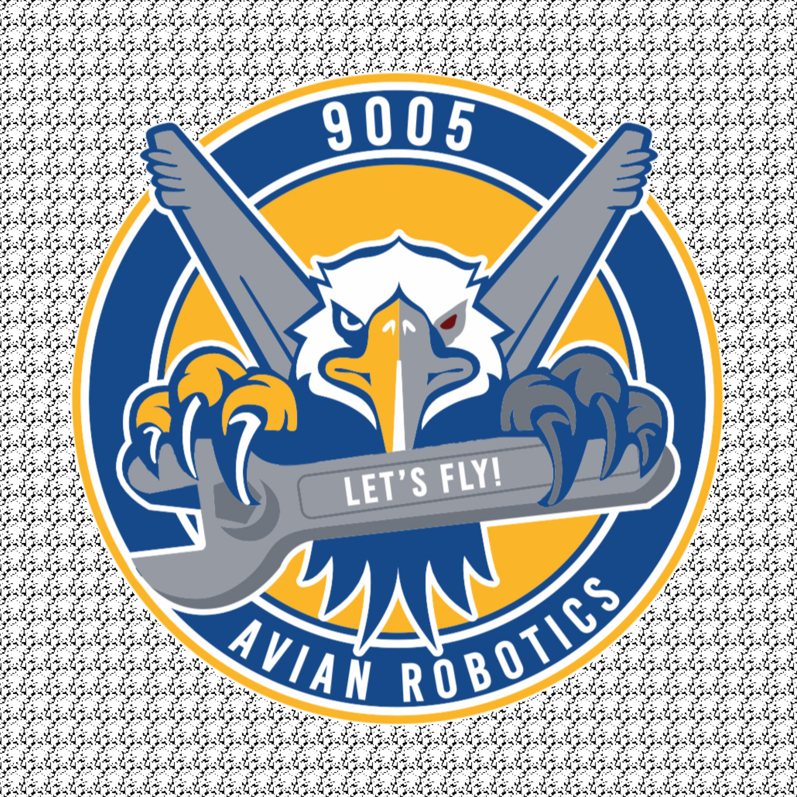

<div align="center">



# FRC 1792 Scouting ● 2026 REBUILT

A web-based scouting application for FIRST Robotics Competition Team 1792.

**Live at:** [princerodrick59.github.io](https://princerodrick59.github.io)

</div>

---

## What It Does

Track robot performance during FRC competitions with two scouting modes:

- **🤖 Match Scouting** – Record robot actions during matches (auto, teleop, endgame)
- **🔧 Pit Scouting** – Document robot specs, drivetrain, dimensions, and capabilities

Data is automatically submitted to Google Sheets for analysis.

---

## Features

- **🔒 Secret code authentication** — Protects submissions while keeping the site public for open alliance
- **🎮 Demo mode** — Lets anyone explore the full app without submitting data
- Multi-step forms with progress tracking
- Team search powered by The Blue Alliance API
- Automatic data submission to Google Sheets
- **Server-side validation** — Rejects submissions without valid team codes
- Works offline, submits when online
- Prevents duplicate team submissions with caching
- Mobile-friendly design
- Visual field position selectors

---

## How to Use

**For Scouts (with team code):**
1. Go to [princerodrick59.github.io](https://princerodrick59.github.io)
2. Enter your **team code** (provided by your team lead)
3. Choose **Match Scouting** or **Pit Scouting**
4. Fill out the form
5. Click **Submit** – data goes straight to Google Sheets

**For Other Teams (demo mode):**
1. Go to [princerodrick59.github.io](https://princerodrick59.github.io)
2. Click **Demo Mode** to explore without submitting data
3. Browse all forms and features freely (input validation disabled)
4. Click **Exit Demo** when done

---

## Tech Stack

- **HTML/CSS/JavaScript** – No frameworks, just vanilla web standards
- **Google Apps Script** – Handles form submissions and writes to Sheets
- **The Blue Alliance API** – Loads team lists from events
- **GitHub Pages** – Free hosting

---

## Setup for Your Team

See the **[Quick Start Guide](docs/QUICK_START_GUIDE.md)** for full step-by-step setup instructions.

**Short version:**

1. Fork/clone this repo
2. Set up Google Sheets + Apps Script backend
3. Edit **`js/config.js`** with your webhook URL, TBA API key, event code, and secret code
4. Update **`appScript/combined-scouting-script.js`** with allowed team codes
5. Update team numbers in `match-scouting.html`
6. Push to GitHub and enable GitHub Pages

---

## Documentation

- **[Quick Start Guide](docs/QUICK_START_GUIDE.md)** — Get running in 30 minutes
- **[Technical Whitepaper](docs/TECHNICAL_WHITEPAPER.md)** — How everything works under the hood

---

## Project Structure

```
├── index.html              # Home page with mode selection
├── match-scouting.html     # Match scouting form
├── pit-scouting.html       # Pit scouting form
├── css/
│   └── styles.css          # Team 1792 branded styles
├── js/
│   ├── config.js           # Shared settings (edit this one!)
│   ├── home.js
│   ├── match-scouting.js   # Match form logic
│   └── pit-scouting.js     # Pit form logic
├── appScript/
│   └── combined-scouting-script.js  # Google Sheets backend
└── docs/                   # Documentation
```

---

**Built for FRC Team 1792 • 2026 Season**
